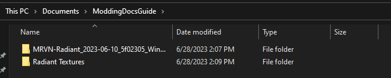
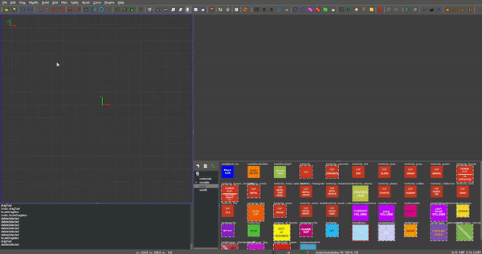
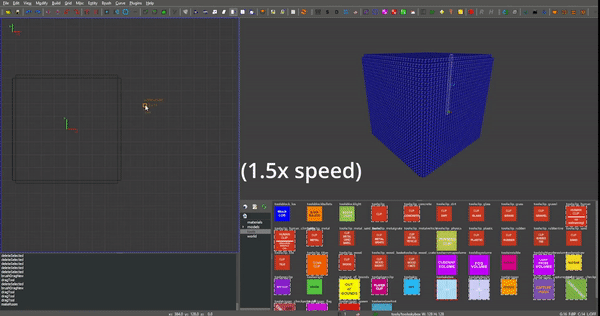
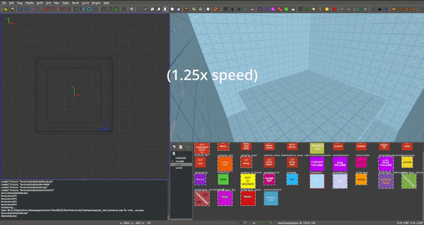
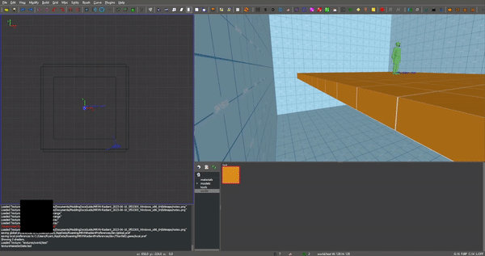
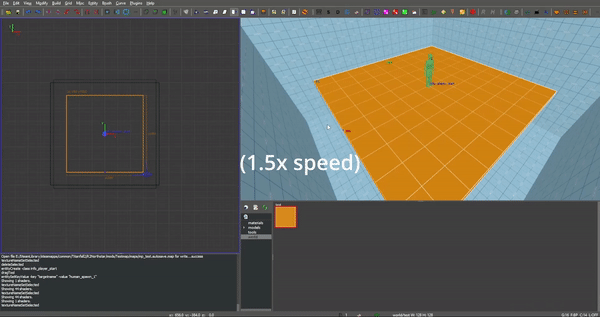

Basic Mapping
=========

The following is a very simple guide to the basics of the Radiant editor used to make modded maps in Titanfall 2. It assumes you're using Windows. The guide also names things as ``Test``, however these names can be changed (and should be once you're done following the tutorial and making your own map fully), but make sure you change all of the names of files to match each other when needed.

Tools:
------

MRVN-Radiant:
^^^^^^^^^^^^^

Level editor for Respawn Entertainment Source based games. To download, open the GitHub repo in another tab, click into the ``Actions`` tab for the repo, click into the newest (top) action, then download ``MRVN-Radiant_<DATE>_<BUILD-VERSION>_Windows_x86_64``

https://github.com/MRVN-Radiant/MRVN-Radiant

Textures:
^^^^^^^^^

Use the following link to download a resource pack to be used later on in the guide. Importing and using textures will be based off of this.

Download the ``Titanfall2.zip`` from the `latest release page for the textures <https://github.com/MRVN-Radiant/MRVN-Resource-Pack/releases/>`_.

Other kinds of editors:
^^^^^^^^^^^^^^^^^^^^^^^^

You'll also need any kind of text editor (the basic built in Windows one will do), and an image editor (if wanting to add custom textures/loadscreens).

This guide will assume you're using `GIMP <https://www.gimp.org/>`_ as an image editor, however you can adjust the wording of the guide for yourself if you'd rather use another image editor.

Very fast (slightly out of date) tutorial:
------------------------------------------

Note that this video doesn't go in depth, however you can use it to learn how to use the editor if you'd rather learn things more on your own, or would rather skip the text guide. The video goes over roughly the same material as the guide, however doesn't include adding textures or loadscreens.

How titanfall custom map:

..  youtube:: gmNzc5Go2ow

Actual Mapping Guide:
---------------------

Setting up Radiant:
^^^^^^^^^^^^^^^^^^^

Move both the MRVN-Radiant and Textures folder downloads to a memorable file (I, for one, put both inside a custom folder to use for the guide's screenshots as shown below) 

|MRVN-Radiant setup|

Make sure the ``Titanfall2`` folder used for textures is inside another folder, for example:

.. code-block:: text

  Radiant Textures
  └─Titanfall2
     ├──maps
     ├──models
     ├──shaders
     └─textures

When you open up Radiant, make sure to select your textures folder as the one *holding* the ``Titanfall2`` folder.

Basics of Radiant:
^^^^^^^^^^^^^^^^^^

The extreme basics of the editor are mainly just the brush tool to create objects in your map and the drag tool. You can create objects with the brush tool by simply dragging over the desired area on the left side of Radiant (this will be referred to as the "axis view" from now on), with the object being created once you stop dragging the mouse. You can change the size of this later by dragging the side you want to change after creating the object. If you select a texture in the bottom right before dragging an object, it will have that texture automatically applied.

You can move the axis view by holding down right click and dragging around the area. You can move around in the preview (or the right) side of the editor by right clicking anywhere on it, then using W, A, S, and D alongside the mouse to move around. Right clicking again will revert back to a cursor.

You can edit the Y value (height) of an object by cycling to the Y axis view (red outline on the axis view) by cycling through axis views by hitting `ctrl + tab`. Once you get to the Y axis view, drag the object around and resize it as you please. In the Y axis view, dragging up/down changes the Y level the object is placed on. By dragging the smaller bar below the object, you can make it taller/shorter. The Z axis view (green outline) can also edit the Y level by moving up/down.

Getting into the actual editor, the process for making a map can be relatively simple (albeit time consuming). For starters, you'll probably want to make a "skybox" so you don't get into the game and see a mess of unrefreshing Source skybox. To do this, drag a square over the area you want to make the "skybox" for to create the box, and adjust it's height accordingly. You can always change this later if you accidentally make it too big or too small.

|Basic skybox creation|

After getting the dimensions you'd like for the "skybox", you'll want to search for and hit the "Make a room" button in the editor. This converts the giant mess of object that you created into 6 thin walls on the perimeter of the object. The textures given to these walls will be used as the skybox for your map. ("Normal" skyboxes don't currently work properly in Radiant)

|Making skybox a room|

Next, we'll create a basic platform. To do this, simply do the same thing you did before to create an object. However, this time instead of stretching the Y axis to be really tall, you'll want to stretch it to be really short (preferably, as short as it will go. This way, you won't waste space in the map and it will run slightly better in the case that performance ends up mattering) and use `ctrl + tab` to cycle over to the X axis view (blue outline on the left side of the editor) and move the base to be inside of the "skybox" you created. Then, make sure it's on a good Y level by checking the Y axis view and adjusting the platform to be at a decent height (probably about halfway through the walls on the Y axis). Then, in the bottom right of the editor you'll notice a collection of images. You can set these images to be used in the editor on specific objects, *however* ``toolskybox`` is the only texture that will appear in game without adding textures to your game. This will be covered later, after adding proper spawns.

|Making a platform|

For now, just set all textures to be ``toolskybox`` if they aren't already by clicking on the object you want to change the texture of, then clicking `toolskybox` in the bottom right corner of the screen, or the texture viewer. We're only using ``toolskybox`` currently because that's all Titanfall 2 has in it's files by default (the rest don't ship with the game when downloaded)

Adding pilot spawns:
^^^^^^^^^^^^^^^^^^^^

To add spawns to your map, right click on the axis viewer and hover over the ``info`` list, then click on ``info_spawnpoint_human``. The model of a pilot this spawns is set to represent both the spawnpoint and the height of the player when they spawn. Adjust this model to sit on your platform (anywhere on it works), then make sure it's on the correct Y level. 

|Adding a spawn|

Then, you'll want to click on it to select it (if not already selected) and press ``N`` or, in the top left of the editor window, click ``View`` and then click ``Entity inspector``. The screen that this opens up is a very important screen for managing spawn points, and should look the same as the one below:

|Default pilot entity inspector|

From here you can input a number of different settings to make the spawn work to your liking. In the ``teamnum`` value tab you can set the number for the team that you'd like the spawn to use. On the top half of the Entity Inspector window, you can see a list of details describing what each thing means. The ``teamnum`` under `keys` shows you the different numbers you can input, and what each of them mean. For this tutorial, we'll be using the team ``-1`` to allow any team to spawn there. 

After setting the team, you *have* to set the ``targetname`` to be something specific. Personally, I rename them to ``human_spawn_{SPAWN NUMBER}``, replacing ``{SPAWN NUMBER}`` with the number of spawn that it is. When you create your first spawn, this should be ``human_spawn_1``, your second spawn should be ``human_spawn_2``, and so on (using this format, of course. You can name this whatever, it's just what I use)

Adding titan spawns:
^^^^^^^^^^^^^^^^^^^^

You `can` skip these spawns, however if you try to spawn in a titan on your map without one, the server will crash.

To add a titan spawn, we use a very similar process to pilot spawns.

This time, right click on the axis viewer, hover over `info` again, instead clicking ``info_spawnpoint_titan`` this time. From here, open up the entity inspector again and, again, set the number for the team. Setting it to ``-1`` will allow any team's titans to spawn there, and only requires making one spawn.

Naming the titan spawns also follow a similar format to pilot spawns. They all also *have* to be named something seperate to themselves, such as ``titan_spawn_1``, ``titan_spawn_2``, and so on.

Initial Mod structure (testing the map):
^^^^^^^^^^^^^^^^^^^^^^^^^^^^^^^^^^^^^^^^

At this point, you can actually save your map and load into it in game! Don't close Radiant yet or anything, as we still need to save the map and make the mod. For this guide, we'll be creating a mod folder inside your Titanfall 2 directory directly.

Create the files shown below inside the ``Titanfall2/R2Northstar/mods`` directory. You can change names as you please, however if you encounter issues try using the names as given below.

.. code-block:: text

  Testmap
  ├──mod.json
  └─mod
     └─maps

Then, open the ``mod.json`` file in a text editor and enter the following content:

.. code-block::

	{
    		"Name": "Test Map",
    		"Description": "Custom test map made in Radiant!",
    		"Version": "1.0.0",
    		"LoadPriority": 1,
    		"RequiredOnClient": true
	}

Now, back in Radiant, in the top left corner of Radiant's window, hit ``File > Save as`` then navigate to the ``maps`` folder that we made earlier. Here, name the map ``mp_test`` (try to keep the ``mp_`` in the name, regardless of what you name it), then hit ``Save``.

After this, there's one last thing to do before we can test the map. This is building the BSP. To do this, hit ``Build`` in the top left corner of Radiant, then click ``Simple BSP``. Do this every time you go to test/use the map.

From here if you've followed the guide fully, you should be able to load your map in game! This does have a slight bit of a process however.

To load your map, open Northstar, then hit ``Launch Northstar``, then hit ``Private Match``. From here, when in the Private Match screen, hover over ``Private Match``, then click ``Settings``. In here, disable ``Classic MP``. After doing this, go back to the main Private Match screen, open the console with ``~``, and type ``map mp_test``. Northstar will then load the custom map! Note that the loading screen will show the map name as ``MP_TEST`` and not something "normal" and localized like the other maps do (example: the Glitch loading screen shows the map name as ``GLITCH`` and not ``MP_GLITCH``). The loading screen will also be a giant missing texture. We will also go over solving this later.

Creating textures to add:
^^^^^^^^^^^^^^^^^^^^^^^^^

Adding textures to the editor is relatively simple and very fast once you get used to it. To do this, we'll need to create a ``.png``, ``.vtf``, and ``.vmt`` file. You can use any photo editor that you like, however I use GIMP and as such will design this guide to describe how to use it to create textures. If using GIMP, install the `GIMP .vtf addon <https://github.com/Artfunkel/gimp-vtf/releases>`_ to create ``.vtf`` files properly.

First off, make sure the layer you're working with is 128x128 pixels. In GIMP, you can do this by hitting ``File > New`` and changing the dimensions to ``128x128`` (if it automatically changes the other number, try hitting the "unlink" or chain button next to the dimensions to stop them from auto adjusting)

After this, create whatever image you want. Note that you will probably encounter issues if trying to create an image with transparency in it. This guide will be using an orange box with a slight outline, partially to showcase fitting the texture to the object and partially because I already have it laying around. I'll attach the ``.png`` version here, if you want to mess around with it before creating your own texture (just make sure to export it as ``.vtf`` from GIMP as well)

|Example texture|

Once the image creation is done, click ``File > Export as`` (if using GIMP), then export the image as ``test.png``, then export again as ``test.vtf``, using the default settings given and just hitting export when the screen comes up. Note that we don't yet create a ``.vmt``!

The following is the part of importing files that `can` be tricky if you aren't sure how to do it. The file path in Radiant and your mod *must* match! With the way that it's done, we'll have to go over mod structure again.

Adding textures to Radiant:
^^^^^^^^^^^^^^^^^^^^^^^^^^^

Adding the textures is probably the hardest part of this simple guide. This guide will go over one specific way to add textures to your mod.

The ``.png`` file we created earlier will go into the folder that Radiant uses for textures, while the ``.vtf`` we created earlier will go into the mod folder.

First, adding the texture to the editor. To do this, we'll replicate the following folder structure

.. code-block:: text

  Radiant Textures
  └─Titanfall2(textures)
    └─textures
      └─world
        └─test.png

After adding the ``.png`` file, make sure to hit the green arrows and "refresh" button in the bottom right textures tab of Radiant. Then, click on `world` in this part of the editor, and you'll see the added ``test`` texture! After doing this, you can click on objects in your map and give them your new texture (in the editor)!

If you only want one side of an object to have a texture, hit ``ctrl`` and click on the side of the texture that you want to change. Make sure to hit ``ctrl`` and click on the side of the object again after editing it to de-select it.

|Change one side of an object texture|

If you want to change how the texture fits on the object, you can click `S` or ``View -> Surface Inspector`` and change how the texture fits onto the object, like shown below:

|Change how a texture fits on an object|

Updated Mod structure (addding textures to Northstar with the mod):
^^^^^^^^^^^^^^^^^^^^^^^^^^^^^^^^^^^^^^^^^^^^^^^^^^^^^^^^^^^^^^^^^^^

Now, adding the texture to the mod's files. This is the tricker part of adding textures.

Replicate the file format shown below (this assumes you've followed the guide to this point and already have the first version of the map files created):

.. code-block:: text

  Testmap
  ├──mod.json
  └─mod
    ├──materials
    |  └─world
    └─maps
      ├──mp_test.map
      └─mp_test.bsp

Note that your ``maps`` folder might hold things like autosaves when working like this. You only need the ``mp_test.map`` and ``mp_test.bsp`` files for the map to work.

After doing this, place the ``test.vtf`` file we exported from GIMP earlier into the ``mod\materials\world`` folder. After you do this, create a file named ``test.vmt``. Then, open ``test.vmt`` in a text editor of your choice and enter the following:

.. code-block::

	"$LightMappedGeneric"
	{
    	"$basetexture" "world/test"
	}

Note how we do `not` end the mention of the file with the ``.vtf`` file extension, despite the texture having the extension!

Testing the added textures:
^^^^^^^^^^^^^^^^^^^^^^^^^^^

Once you do everything leading up to this point, your mod folder should look something like this:

.. code-block:: text

  Testmap
  ├──mod.json
  └─mod
    ├──materials
    |  └─world
    |    ├──test.vmt
    |    └─test.vtf
    └─maps
      ├──mp_test.map
      └─mp_test.bsp

After doing this, you should be able to load the map as you did previously, but this time with the added textures! (assuming you edited some objects to use the new textures)

Adding a loading screen:
^^^^^^^^^^^^^^^^^^^^^^^^

Adding loading screens requires the use of `RePak` to create a ``.rpak`` file to be used for your map. Setting up RePak is a somewhat lengthy process.

First, `download RePak.exe <https://github.com/r-ex/RePak/releases>`_

Then, make a folder for RePak and replicate the file format shown below:

.. code-block:: text

  RePak
  ├──assets
  |  └─texture
  |    └─loadscreens
  ├──maps
  |  └─loadscreen.json
  ├──rpaks
  ├──pack_all.bat
  └─RePak.exe

We'll first create the ``loadscreen.json``. One way to do this is to open the file in a text editor and put in the text shown below:

.. code-block:: text

	{
    		"name": "mp_test_loadscreen",
   	 	"assetsDir": "../assets",
    		"outputDir": "../rpaks",
   		 "version": 7,
   		 "files":[
     		   {
       		     "$type": "txtr",
       		     "path":    "texture/loadscreens/test_loadscreen",
            "saveDebugName": true    
     		   },
     		   {
       		     "saveDebugName": false,
       		     "$type":"matl",
        	     "version":12,
        	     "path":"loadscreens/mp_test_widescreen",
        	     "type": "gen",
        	     "subtype":"loadscreen",
        	     "surface": "default",
        	     "width": 1920,
        	     "height": 1080,
        	     "textures":["texture/loadscreens/test_loadscreen"]
            
       		 }
   	    ]
	}

Next, we'll create ``pack_all.bat``. Right click on ``pack_all.bat``, then click `Edit`, and enter the following into the file:

.. code-block:: text

for %%i in ("%~dp0maps\*") do "%~dp0RePak.exe" "%%i"
pause

Now, we can finally get to creating the loading screen. To do this, you'll want to create or import any image you want into GIMP. From here, press ``shift + s``, and type in the dimensions ``1920`` for width and ``1080`` for height. These are the dimensions used to make a proper loading screen. After you've imported and scaled your image, in the top right of GIMP click ``File > Export as``, then enter ``test_loadscreen.dds`` and set the ``Compression method`` to ``DXT1``. After doing this, move the image to be inside of the ``loadscreens`` folder we created inside the RePak folder earlier.

After doing this, the RePak folder should look like this:

.. code-block:: text

  RePak
  ├──assets
  |  └─texture
  |    └─loadscreens
  |      └─test_loadscreen.dds
  ├──maps
  |  └─loadscreen.json
  ├──rpaks
  ├──pack_all.bat
  └─RePak.exe

If you've followed everything so far, double click on ``pack_all.bat``. This will open a command prompt with some information given to you, which for this case you can simply skip past by hitting any key on your keyboard. 

After you've done this and RePak has created the ``.rpak``, you should see a file called ``mp_test_loadscreen.rpak`` in the ``rpaks`` folder of RePak.

Adding the loadscreen to the Northstar mod (updated mod format):
^^^^^^^^^^^^^^^^^^^^^^^^^^^^^^^^^^^^^^^^^^^^^^^^^^^^^^^^^^^^^^^^

Create a folder called ``paks`` in the root of your mod's directory. Inside of here, place the ``mp_test_loadscreen.rpak`` file that we exported from RePak earlier and create a file called ``rpak.json``. Open ``rpak.json`` in a text editor and put in the text shown below:

.. code-block:: text

	{
		"Preload": {
			"mp_test_loadscreen.rpak": "false"
		}
	}

If this doesn't work, make sure the names match up properly, that the image is ``1920`` x ``1080``, and that you used compression method ``DXT1`` when exporting the image from your image editor.

Testing the loadscreen:
^^^^^^^^^^^^^^^^^^^^^^^

If you've followed everything to this point, your mod folder should look something like this:

.. code-block:: text

  Testmap
  ├──mod.json
  ├──mod
  |  ├──materials
  |  |  └─world
  |  |    ├──test.vmt
  |  |    └─test.vtf
  |  └─maps
  |    ├──mp_test.map
  |    └─mp_test.bsp
  └─paks
    ├──mp_test_loadscreen.rpak
    └─rpak.json

After all of this, the map should have a loading screen when loading it as we did before. 

Continuing to create the map:
^^^^^^^^^^^^^^^^^^^^^^^^^^^^^

From here, you might be able to piece together bits and pieces of information in order to create a proper functioning map to your liking. Due to the simplicity of this guide, you probably won't be able to go straight from this to a full size map found in vanilla Titanfall 2, but you should at least know the basics. You can always ask for more help in the ``#maps-chat`` channel in the Northstar Discord if you're confused.

Other:
------

Netradiant Custom Tutorial - Part 2:

..  youtube:: JZO8H4rBqtA

How to make corners correctly
^^^^^^^^^^^^^^^^^^^^^^^^^^^^^

Improper corners can cause the player to get stuck

.. figure:: /_static/map-corners.png
  :class: screenshot

..  youtube:: mwvxonuCm8U

Sample clip: 

..  youtube:: zgWDme7Y6oI

Sample map: https://cdn.discordapp.com/attachments/925435799057604709/1041813222547791953/corner_test_map.map

.. |Making skybox a room| image:: mapping-guide-images/skybox-make-a-room.gif

.. |Default pilot entity inspector| image:: mapping-guide-images/entity-inspector-pilot-default.png

